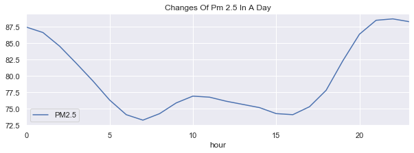
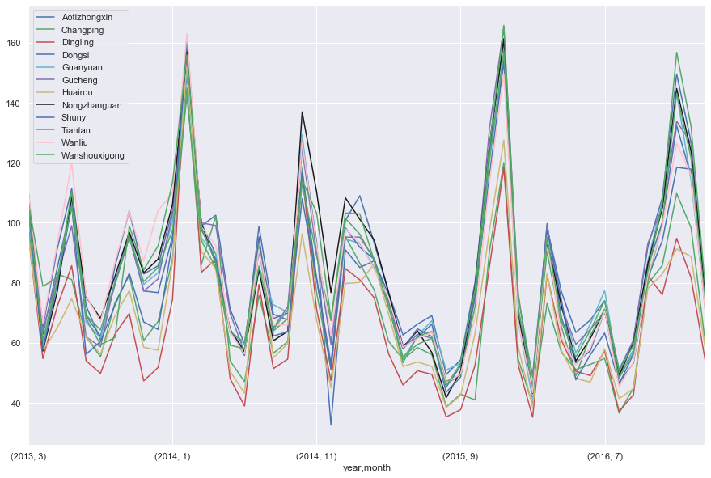
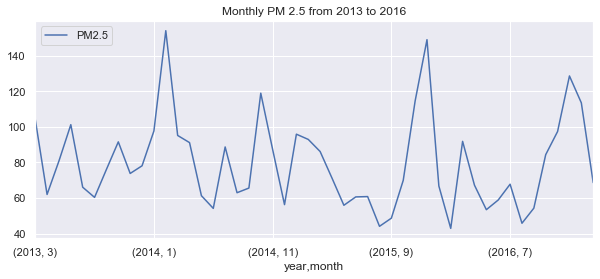
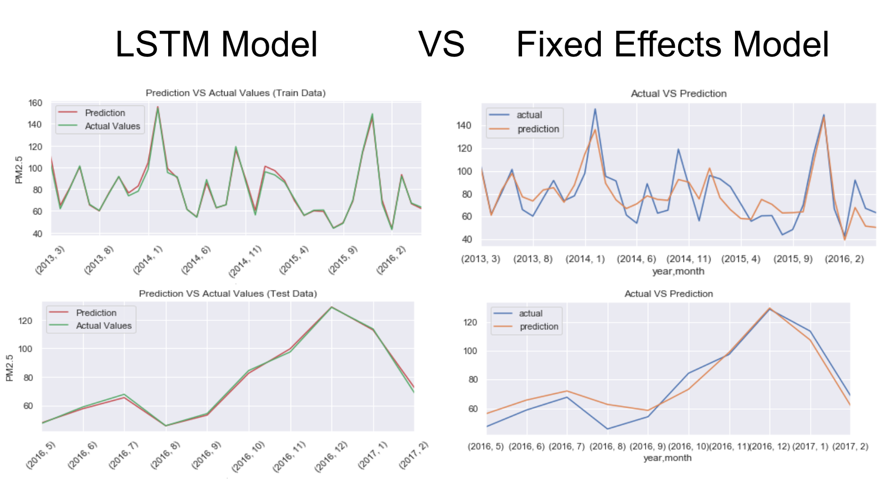
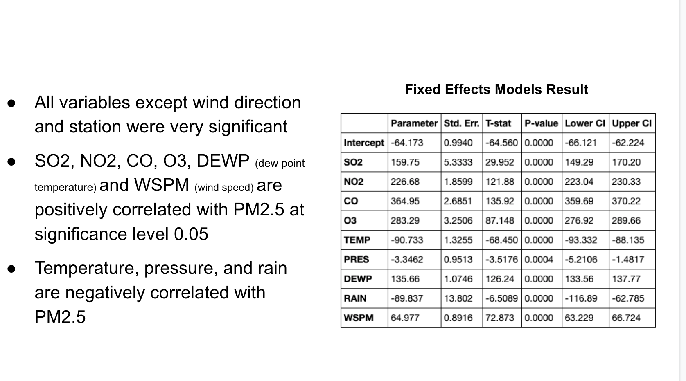

## Time Series Panel Data Project
Team members: 
- Hua Shi
- David Katzman 

## Attribute Information
The data is from UCI. The endogenous variable is PM2.5 and the exogenous variables are SO2, NO2, CO, O3, TEMP, PRES, DEWP, RAIN, WSPM, explained below:

- PM2.5: PM2.5 concentration (ug/m^3). PM2.5 is a type of PM10. PM2.5 generally accounts for about 70% of PM10.
- PM10: PM10 concentration (ug/m^3)
- SO2: SO2 concentration (ug/m^3)
- NO2: NO2 concentration (ug/m^3)
- CO: CO concentration (ug/m^3)
- O3: O3 concentration (ug/m^3)
- TEMP: temperature (degrees Celsius)
- PRES: pressure (hPa)
- DEWP: dew point temperature (degrees Celsius)
- RAIN: precipitation (mm)
- wd: wind direction
- WSPM: wind speed (m/s)
- station: name of the air-quality monitoring site

## Goal
The goal of this project is to predict PM2.5 for 12 different locations in Beijing. For the panel data, Fixed effects, Random effects, and Pooled OLS models are applied, while an LSTM model is used for each individual station. We conducted the Lagrange Multiplier and Huasmen tests to compare the Fixed effects, Random effects, and Pooled OLS models, and the results show that the fixed model is the best choice of the three. Based on the RMSE (Root Mean Square Error) of the fixed effects and LSTM models, LSTM is selected as the final model.

## Data Cleaning
- For time series data, missing values should not be imputed with the mean of the series. The Backward Fill method is instead applied to fill in the missing data
- Method source: https://www.machinelearningplus.com/time-series/time-series-analysis-python/

## EDA

### PM2.5 changes in a day (mean)
- The PM2.5 value is lower during rush hour (7am-9am), because vehicle emissions do not directly create PM2.5, but rather create other particles
- However, these other particles react with one another to then create PM2.5
- At night, colder air settles close to the ground due to the lack of sun, and stagnant air causes higher pollution density

### PM2.5 changes of different stations
- Based on the yearly changes of PM2.5, there are four peak points
- During the winter months (from Oct. to Feb.), large amounts of heat are provided, causing large amounts of exhaust 
- High rainfall from April and September caused low PM2.5 values

## Models
- Fixed Estimator 
- Random Estimator
- Pooled OLS
- LSTM(RNN)

## Conclusion

####  Based on RMSE  LSTM-RNN performed by far the best, but also provides the least information.

#### LSTM prediction_vs_actual values

#### Fixed Effects performed the best of the non black-box models, and the results from Fixed Effects model shows that all exogenous variables affect PM2.5 at significant level 0.05.

 ## Presentation
 https://docs.google.com/presentation/d/1NNXJSYS2ibqs8D-aJng0CkixAEjXZw26gSRNp2Wawe8/edit?ts=5e7d1645#slide=id.p
 
