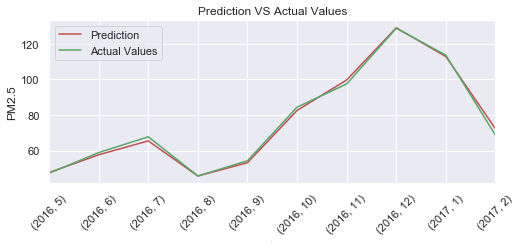

## Time Series Panel Data Project
Team member: 
- Hua Shi
- David Katzman 
## Attribute Information
The data is from UCI. The endogenous variable is PM2.5 and  others are the exogenous variables (SO2,NO2,CO,O3,TEMP,PRES,DEWP	,RAIN,WSPM).

- PM2.5: PM2.5 concentration (ug/m^3) PM2.5 is a kind of PM10, they are inclusive relationships, PM2.5     generally accounts for about 70% of PM10.
- PM10: PM10 concentration (ug/m^3)
- SO2: SO2 concentration (ug/m^3)
- NO2: NO2 concentration (ug/m^3)
- CO: CO concentration (ug/m^3)
- O3: O3 concentration (ug/m^3)
- TEMP: temperature (degree Celsius)
- PRES: pressure (hPa)
- DEWP: dew point temperature (degree Celsius)
- RAIN: precipitation (mm)
- wd: wind direction
- WSPM: wind speed (m/s)
- station: name of the air-quality monitoring site

## Goal
The goal of this project is to predict PM2.5 for 12 different locations in Beijing. For panel data,Fixed effects, Random effects,Pooled OLS are applied in this project. LSTM is applied for individual station. We use the Lagrange Multiplier test and Huasmen test to compare Fixed effects, Random effects,Pooled OLS, and the result shows the fixed model is the better choice. Based on RMSE(Root Mean Square Error) of fixed effects model and LSTM, LSTM is selected as the final model.

## Data Cleaning
- For time series, it is not proper to replace missing values with the mean of the series. Backward Fill method is applied to fill out the missing data.
method source:https://www.machinelearningplus.com/time-series/time-series-analysis-python/
## EDA

## Models
- Fixed Estimator 
- Random Estimator
- Pooled OLS
- LSTM(RNN)
## Conclusion
 All exogenous variables affect PM2.5 at significant level 0.05.
 The LSTM model predicts very well.
 
 
 ## Presentation
 https://docs.google.com/presentation/d/1NNXJSYS2ibqs8D-aJng0CkixAEjXZw26gSRNp2Wawe8/edit?ts=5e7d1645#slide=id.p
 
